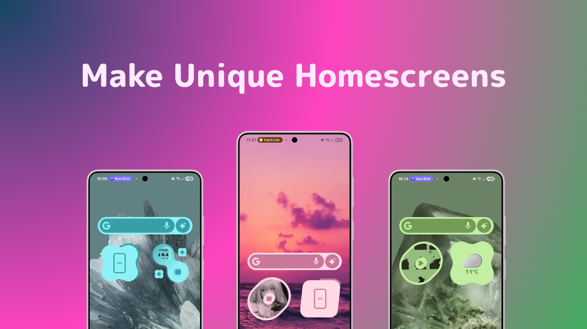

# YouShade ⭐

<p align="center">
  
</p>

<p align="center">
  <strong>Beatiful Material Expressive Inspired widgets for KWGT</strong><br>
  Dashboard built with Kuper
</p>

# ⚠️ This isn't an standalone app, you need [KWGT](https://play.google.com/store/apps/details?id=org.kustom.widget) too

# 🖼️ Current Widgets and Content

| Name | Description |
|----------|------------|
| **Music Widget** | Widget for Music, click on the left or right to skip/go back |
| **Battery Widget** | Widget that shows your Battery with a progess around it |
| **Double Music Widget** | Widget with dedicated skip buttons in an drop form |
| **Search Widget** | Widget for opening Google, Gemini or launching song search |
| **Base Widget** | Use this widget to make your own |

### Included in the app are also some wallpaper

# ⬇️ Get YouShade Expressive from here

[](https://github.com/WollyDev24/YouShade/releases)
[](https://apps.obtainium.imranr.dev/redirect?r=obtainium://add/https://github.com/WollyDev24/YouShade)
[](https://fdroid.org)
<!-- [](https://fdroid.org) -->

<p align="center">
  
</p>

# 🛠️ Good to know stuff

### if you just want the widgets and no app:
- All widgets are in ``Kuper/app/src/assets/widgets``. just remove the .zip from every file to use them

### building the app from source:

- Clone the repo:
```bash
git clone https://github.com/WollyDev24/YouShade/
```

- open the ``Kuper`` folder in Android studio (ONLY the Kuper folder!)
- wait for gradle to sync
- build the app
